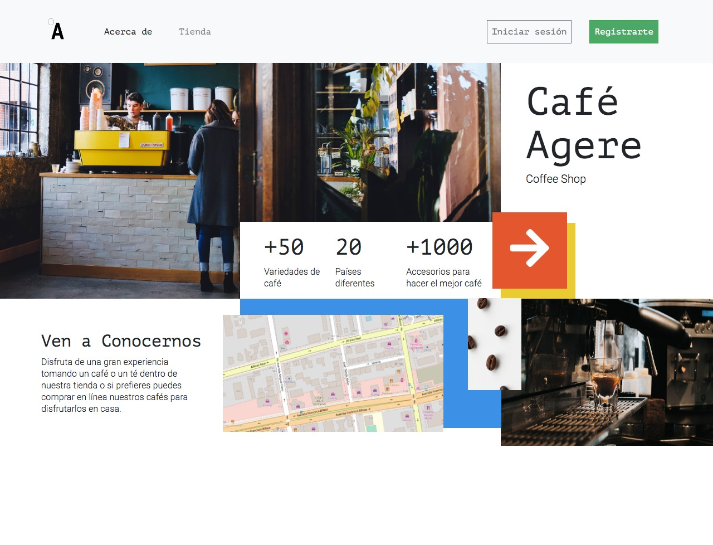

# cafe-agere
Para realizar este desafío debes haber estudiado previamente todo el material disponibilizado en la sesión online 
correspondiente a la unidad. Una vez terminado el desafío, comprime la carpeta y sube el .zip

> Página web  usando Bootstrap Sass a modo de aprovechar la gran cantidad de componentes y clases que aliviarán tu trabajo.

## Instrucciones.
